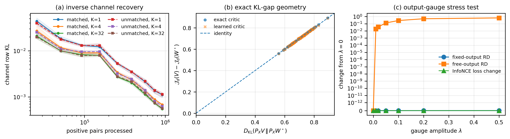
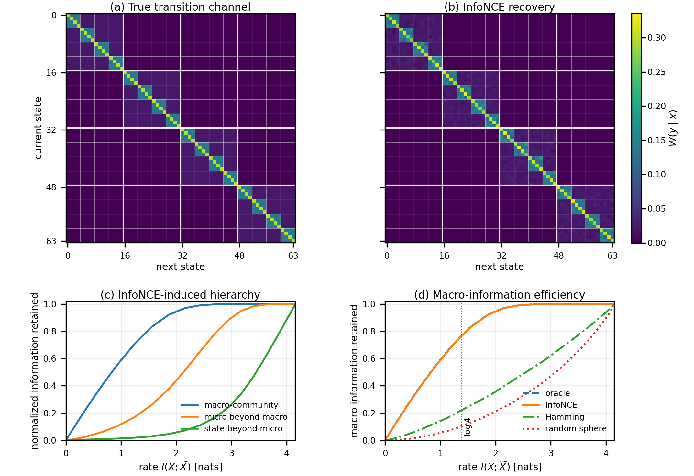
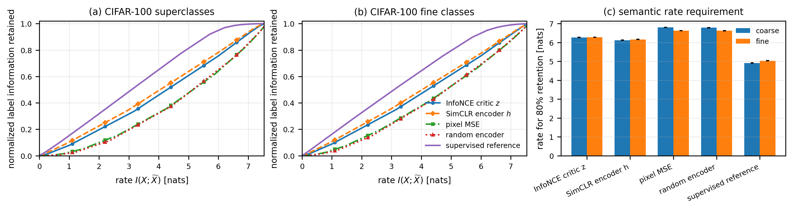

# InfoNCE as inverse fixed-output rate-distortion

This repository contains the experiments for **Beyond Linsker's Infomax
Principle: A Rate-Distortion Perspective on InfoNCE**. The paper asks:

> **Which information-theoretic optimization problem does finite-\(K\)
> InfoNCE solve?**

The experiments support the answer developed in the paper: an InfoNCE-optimal
critic acts as an operational distortion for a **fixed-output
rate-distortion** problem; when the two views have the same marginal, this
specializes to marginal-preserving rate-distortion.

This public version is scheduler-free. There are no Slurm files, job arrays,
or cluster-specific paths. Every stage runs **sequentially** and completed
CIFAR checkpoints are reused automatically.

[Paper PDF](paper/Beyond_Linskers_Infomax_Principle_ITW2026.pdf)

## Experiments

1. **Generic positive-pair channels.** Start from an arbitrary full-support
   coupling, learn a tabular finite-\(K\) InfoNCE critic, reconstruct the
   fixed-output RD optimizer, verify the exact joint-KL gap identity, and test
   the output-dependent critic gauge.
2. **Hierarchical Markov coarse-graining.** Learn from adjacent states of a
   stationary reversible Markov chain, then solve the induced
   marginal-preserving RD problem to expose a macro/micro/state compression
   hierarchy.
3. **CIFAR-100 semantic rate-distortion.** Train SimCLR and a supervised
   reference sequentially, solve empirical marginal-preserving RD using the
   learned representation distances, and measure how much superclass and
   fine-class information survives at each information rate.
4. **Optimizer-floor ablation.** Diagnose the late-stage plateau in tabular
   channel recovery using learning-rate decay, Polyak tail averaging, and
   larger effective batches.

## Reported results

The numerical summaries and plots used below are bundled under
`results/paper/` and `assets/`. They can be inspected without rerunning neural
training.

### 1. Generic-channel theorem experiment



At the final budget of 921,600 positive pairs, ten-seed median weighted row KL
was:

| Marginals | \(K=1\) | \(K=4\) | \(K=32\) |
|---|---:|---:|---:|
| matched \(p_Y=p_X\) | \(1.11\times10^{-3}\) | \(6.74\times10^{-4}\) | \(5.48\times10^{-4}\) |
| unmatched \(p_Y\neq p_X\) | \(1.13\times10^{-3}\) | \(6.29\times10^{-4}\) | \(5.62\times10^{-4}\) |

The exact critic satisfied

\[
\mathcal J_d(V)-\mathcal J_d(W^\star)
= D_{\mathrm{KL}}(P_XV\,\|\,P_XW^\star)
\]

to floating-point precision (maximum error \(4.44\times10^{-16}\)). For the
learned critic, the mean absolute deviation from the identity was
\(2.01\times10^{-3}\) nats. Adding an output-only gauge left InfoNCE and the
fixed-output RD solution unchanged (maximum channel TV
\(3.25\times10^{-15}\)), while the free-output solution moved by as much as
0.646 TV.

### 2. Hierarchical Markov coarse-graining



Across ten independently generated chains, the recovered transition channel
had median row KL

\[
9.71\times10^{-3}\quad [9.22\times10^{-3},\,1.03\times10^{-2}]
\]

where brackets are the 10th--90th percentile range. The median rates required
to retain 90% of each incremental information level were:

| Retained information | Oracle | InfoNCE |
|---|---:|---:|
| macro-community | 1.780 nats | 1.788 nats |
| micro beyond macro | 2.990 nats | 3.002 nats |
| state beyond micro | 4.020 nats | 4.020 nats |

At rate \(\log 4\), the learned distortion retained 76.5% of macro information,
21.1% of the remaining micro information, and 2.4% of within-micro state
information. Hamming and random-spherical distortions retained only 22.1% and
10.4% of macro information at the same rate.

### 3. CIFAR-100 semantic rate-distortion



The theorem-facing representation is `simclr_z`, the normalized projection
space used by the InfoNCE loss. At 80% semantic retention, the median required
rates over three training seeds were:

| Distortion / representation | Superclass | Fine class |
|---|---:|---:|
| supervised reference \(h\) | 4.913 | 5.030 |
| SimCLR encoder \(h\) | 6.118 | 6.162 |
| **InfoNCE critic \(z\)** | **6.265** | **6.272** |
| random encoder | 6.782 | 6.622 |
| pixel MSE | 6.795 | 6.620 |

Thus the InfoNCE critic required 0.530 fewer nats than pixels for 80%
superclass retention and 0.348 fewer nats for fine-class retention. The gain
is broader at intermediate rates. The experiment supports **semantic rate
efficiency**; it does not establish a sharp coarse-before-fine phase
transition on CIFAR-100.


## Installation

Python 3.10 or newer is required.

### Full installation

```bash
python3 -m venv .venv
source .venv/bin/activate       # Windows: .venv\Scripts\activate
python -m pip install --upgrade pip
python -m pip install --no-build-isolation -e ".[cifar,dev]"
pytest -q
```

For a CUDA machine, install the PyTorch build appropriate for your CUDA version
before the editable install when necessary. A tabular-only installation avoids
PyTorch:

```bash
python -m pip install --no-build-isolation -e ".[dev]"
```

Equivalent requirement files are included:

```bash
python -m pip install -r requirements.txt          # all experiments
python -m pip install -r requirements-tabular.txt  # tabular only
```

## Sequential reproduction

### Fast offline numerical smoke test

This does not download CIFAR-100 or train a network:

```bash
python scripts/smoke_test.py --output-dir results/smoke/cifar_synthetic
```

### Quick end-to-end profile

The quick profile uses one seed, small tabular problems, and one CIFAR training
epoch per model:

```bash
python scripts/run_all.py \
  --profile quick \
  --output-root results/quick \
  --device auto
```

### Paper tabular experiments

These run on a laptop CPU:

```bash
python scripts/run_tabular.py \
  --profile paper \
  --output-root results/reproduced/tabular
```

Or separately:

```bash
python scripts/run_generic_channel.py \
  --config configs/paper/generic_channel.json \
  --outdir results/reproduced/generic_channel

python scripts/run_markov.py \
  --config configs/paper/markov.json \
  --outdir results/reproduced/markov
```

### CIFAR-100 experiment

The script downloads CIFAR-100 once, then processes each seed sequentially:

```text
seed 0: SimCLR -> supervised reference -> features -> RD
seed 1: SimCLR -> supervised reference -> features -> RD
seed 2: SimCLR -> supervised reference -> features -> RD
aggregate all seeds
```

Run:

```bash
python scripts/run_cifar.py \
  --config configs/paper/cifar.json \
  --data-root data/cifar100 \
  --output-root results/reproduced/cifar \
  --device cuda
```

Completed training checkpoints and per-seed RD outputs are reused. Rerunning the
same command resumes interrupted training and skips validated completed stages.
Use `--overwrite` only when intentionally replacing an output directory.

The paper profile trains three SimCLR models for 400 epochs and three supervised
references for 200 epochs. A single CUDA GPU is strongly recommended. The RD
stage uses a balanced 2,000-image subset, producing dense 2,000-by-2,000
couplings.

### Every paper experiment in one command

```bash
python scripts/run_all.py \
  --profile paper \
  --output-root results/reproduced \
  --data-root data/cifar100 \
  --device cuda
```

Add the optimizer study with:

```bash
python scripts/run_all.py \
  --profile paper \
  --output-root results/reproduced \
  --data-root data/cifar100 \
  --device cuda \
  --include-optimizer-ablation
```

There is no experiment-level or seed-level parallelism in these orchestration scripts. CIFAR data loading may still use the configurable number of local worker processes.

## Rebuild the bundled plots

The README figures can be regenerated directly from the included CSV, JSON,
and NPZ summaries:

```bash
python scripts/rebuild_bundled_figures.py
```

## Output layout

```text
results/reproduced/
├── generic_channel/
│   ├── metrics.json
│   ├── diagnostic_arrays.npz
│   └── generic_channel_theorem_experiment.{pdf,png}
├── markov/
│   ├── metrics.json
│   ├── multiseed_summary.csv
│   ├── seed_000/ ... seed_009/
│   └── markov_full.{pdf,png}
├── cifar/
│   ├── checkpoints/
│   ├── per_seed/seed_000/ ...
│   └── aggregate/
│       ├── aggregate_curves.csv
│       ├── aggregate_thresholds.csv
│       ├── feature_diagnostics.csv
│       └── cifar100_semantic_rd.{pdf,png}
└── optimizer_ablation/
    ├── pair_budget/
    └── step_budget/
```

Validate a finished main run with:

```bash
python scripts/validate_results.py --root results/reproduced
```

## Repository layout

```text
assets/              figures used in this README and the paper
configs/             quick, pilot, and paper profiles
paper/               camera-ready manuscript PDF
results/paper/       bundled numerical summaries from reported runs
scripts/             sequential command-line entry points
src/itw_rd/          tabular InfoNCE and fixed-output RD experiments
src/itw_cifar_rd/    CIFAR models, training, Sinkhorn RD, and aggregation
tests/               numerical, model, and configuration tests
```

## Reproducibility notes

- Tabular experiments use NumPy `float64` for theorem checks and Sinkhorn
  projections.
- The generic-channel paper run uses multistep decay at 20%, 50%, and 80% of
  training, with multiplicative factor 0.25.
- CIFAR labels are never used by SimCLR or by RD optimization; they are used
  only to evaluate semantic information retention.
- The supervised CIFAR model is a reference ceiling, not a self-supervised
  baseline.
- The bundled repository includes aggregate CIFAR outputs but not neural
  checkpoints or extracted feature tensors because of their size.
- `simclr_z` is the theorem-facing distortion. `simclr_h` is reported as a
  separate diagnostic and is never silently substituted for `z`.

Detailed experiment definitions are in [docs/EXPERIMENTS.md](docs/EXPERIMENTS.md),
and additional interpretation is in [docs/RESULTS.md](docs/RESULTS.md).
